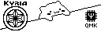

# Dakes' Keymap

To use this, you will have to activate a german keyboard layout.  
If you are not using Linux, change the line: 
`#define UNICODE_SELECTED_MODES UC_LNX`  
in `config.h` according to your operating system. 

The Function Layer will activate, when either LAY3 and LAY5, LAY4 and LAY6 or LAY3 and LAY4 are pressed.  
On the Function Layer the encoders will cycle through the base layers. The current one will be displayed on the OLED  

# Modular Bongo Cat

  

This Modular Bongo Cat uses diffs instead of complete frames, thus saving space.  
*Why Modular?* It is super easy to remove the QMK logo, or Kyria logo to save additional space in your firmware.  
Instead you could also create and add your own logo. 
For that I have added a python script (`png_to_short_arr.py`) that you can use, to generate the arrays and diffs from your own images.  
I also added the bongocat frames, that I have redrawn by hand in the folder [bongocat_frames](bongocat_frames)

## How to draw your own images
Any Image manipulation program will do, though I recommend Krita.  
It doesn't matter if you choose to use black or white for "Pixel on" , since you can invert it later in the python skript using the flag `invert_colors`.  
I prefer to use black for on, since it is easier visible.  
The important part is to use transparency for the background, since it will be interpreted as "ignore pixel" and not included in the final array, thus saving tremendous space.  
The disadvantage is, that everything that was drawn before, at that position, will "shine through", since the pixel will stay on. This could be wanted or not.  
Usually you should only use the off color (White in my case) when you know, you want to turn off a pixel, that was on before.  
For Example the Kyria logo only uses white to overwrite the black line of the base frame. If I would paint all the interior of the logo white firmware space would be wasted, 
since all the pixels below it are always off anyway.  
Finally it is important to save your image as png with 8-bit color depth, because jpg does not support transparency.  

### Convert to array
In `png_to_short_arr.py` you will have to include your new images in the `frame_filenames` list. 
Add your images to the `bongocat_frames` folder, execute the python script, while being in the keymap folder,  
or edit `path_to_images` to point to the folder with your images.  
The output will be an Array formatted so, that you can copy paste it into your keymap.  

If you want to add logos, etc. use the output from the section `Pixel values without diff`.  
If you want to replace Bongocat, by for example the blush frames, use the output from `Pixel diffs with idle_0.png as the base frame` 
and put them in the appropriate diff arrays. 

### Add to keymap
Add the arrays and function calls where the comments say `// Add your own logos here, or remove to save firmware size`  
The function `render_short_array_pos` will render the array. 
The 1. parameter is a pointer to your `uint16_t PROGMEM` array
The 2. and 3. parameters are x and y coordinates, from where it should start to draw the image. 
Note, that with images, coordinates start from the top left. 
The 4th parameter is the width of your image. 

## Size comparison
|               | James Incandenza's (j-inc) original  | Pierre Chevalier's bongo_light  | Dakes' Modular Bongo Cat | Dakes' Modular Bongo Cat (without Kyria and QMK logo) |
| ------------- | ------------- | ------------- | ------------- | ------------- |
| Bytes saved compared to j-inc's | 0  | 3830  | 3216  | 4564 |
| additional bytes needed       | 7210  | 3380  | 3994  | 2646 |
| in bytes free (for my measurement) | 1670  | 5500  | 4886  | 6234 |


Notes:
- The numbers for bongo_light don't include the changes to drivers/oled.  
- You could remove `#include <stdio.h>` from Pierre Chevalier's bongo_light and replace `sprintf` by my method of rendering the WPM String 
  to save additional ~1200 bytes. 

# Layers
## Layer 1: Base Layers

### Neo
https://neo-layout.org/
```
,-------------------------------------------.                              ,-------------------------------------------.
|LAY3/tab|   X  |   V  |   L  |   C  |   W  |                              |   K  |   H  |   G  |   F  |   Q  |ß/AltGr |
|--------+------+------+------+------+------|                              |------+------+------+------+------+--------|
| LShift |   U  |   I  |  A   |   E  |   O  |                              |   S  |   N  |   R  |   T  |   D  |Y/RShift|
|--------+------+------+------+------+------+-------------.  ,-------------+------+------+------+------+------+--------|
| LCtrl  |   Ü  |   Ö  |   Ä  |   P  |   Z  | LAY5 | LAY6 |  | LAY5 | LAY6 |   B  |   M  | , ;  | . :  |   J  |-_ /RCtl|
`----------------------+------+------+------+------+------|  |------+------+------+------+------+----------------------'
  encoder: skip tracks | Play | GUI  | LALT | Space| Enter|  | Enter| Space| Bksp | Del  | Mute | encoder: volume
                  ---> |      |      |      | LAY3 | LAY4 |  | LAY3 | LAY4 |      |      |      | <---
                       `----------------------------------'  `----------------------------------'
```

### Qwertz
```
,-------------------------------------------.                              ,-------------------------------------------.
|LAY3/tab|   Q  |   W  |   E  |   R  |   T  |                              |   Z  |   U  |   I  |   O  |   P  |Ü/AltGr |
|--------+------+------+------+------+------|                              |------+------+------+------+------+--------|
| LShift |   A  |   S  |  D   |   F  |   G  |                              |   H  |   J  |   K  |   L  |   Ö  |Ä/RShift|
|--------+------+------+------+------+------+-------------.  ,-------------+------+------+------+------+------+--------|
| LCtrl  |   Y  |   X  |   C  |   V  |   B  | LAY5 | LAY6 |  | LAY5 | LAY6 |   N  |   M  | , ;  | . :  | - _  | ß/RCtl |
`----------------------+------+------+------+------+------|  |------+------+------+------+------+----------------------'
  encoder: skip tracks | Play | GUI  | LALT | Space| Enter|  | Enter| Space| Bksp | Del  | Mute | encoder: volume
                  ---> |      |      |      | LAY3 | LAY4 |  | LAY3 | LAY4 |      |      |      | <---
                       `----------------------------------'  `----------------------------------'
```


### Gaming
*In development*

## Layer 2: shift layer
Same as Layer 1, activated with shift. (default shift)

## Layer 3: Symbols
```
,-------------------------------------------.                              ,-------------------------------------------.
|        |   °  |   _  |   [  |   ]  |   ^  |                              |   !  |   <  |   >  |   =  |   &  |   §    |
|--------+------+------+------+------+------|                              |------+------+------+------+------+--------|
|        |   \  |   /  |   {  |   }  |   *  |                              |   ?  |   (  |   )  |   -  |   :  |   @    |
|--------+------+------+------+------+------+-------------.  ,-------------+------+------+------+------+------+--------|
|        |   #  |   $  |   |  |   ~  |   `  |      |      |  |      |      |   +  |   %  |   "  |   '  |   ;  |   €    |
`----------------------+------+------+------+------+------|  |------+------+------+------+------+----------------------'
                       |      |      |      |      |      |  |      |      |      |      |      |
                       |      |      |      |      |      |  |      |      |      |      |      |
                       `----------------------------------'  `----------------------------------'
```

## Layer 4: Navigation and Numpad
```
,-------------------------------------------.                              ,-------------------------------------------.
|   esc  | PgUp | Bksp |  up  | del  | PgDn |                              |   *  |   7  |   8  |   9  |   +  |   -    |
|--------+------+------+------+------+------|                              |------+------+------+------+------+--------|
|        | home | left | down | right| end  |                              |   /  |   4  |   5  |   6  |   ,  |   .    |
|--------+------+------+------+------+------+-------------.  ,-------------+------+------+------+------+------+--------|
|        |  esc |  tab |insert| enter|undo  |      |      |  |      |      |   :  |   1  |   2  |   3  |   ;  |   =    |
`----------------------+------+------+------+------+------|  |------+------+------+------+------+----------------------'
                       |      |      |      |      |      |  |      |   0  |      |      |      |
                       |      |      |      |      |      |  |      |      |      |      |      |
                       `----------------------------------'  `----------------------------------'
```

## Layer 5: Small greek letters
```
,-------------------------------------------.                              ,-------------------------------------------.
|    ₁   |   ξ  |   ϰ  |   λ  |   χ  |   ω  |                              |   κ  |   ψ  |   γ  |   φ  |   ϕ  |    ς   |
|--------+------+------+------+------+------|                              |------+------+------+------+------+--------|
|    ₂   |   θ  |   ι  |   α  |   ε  |   ο  |                              |   σ  |   ν  |   ρ  |   τ  |   δ  |    υ   |
|--------+------+------+------+------+------+-------------.  ,-------------+------+------+------+------+------+--------|
|    ₃   |   ₀  |   ϵ  |   η  |   π  |   ζ  |      |      |  |      |      |   β  |   μ  |   ϱ  |   ϑ  |   ⟨  |    ⟩   |
`----------------------+------+------+------+------+------|  |------+------+------+------+------+----------------------'
                       |      |      |      |      |      |  |      |      |      |      |      |
                       |      |      |      |      |      |  |      |      |      |      |      |
                       `----------------------------------'  `----------------------------------'
```

## Layer 6: Big greek letters and Mathematical Symbols
```
,-------------------------------------------.                              ,-------------------------------------------.
|    ∞   |   Ξ  |   √  |   Λ  |   ℂ  |   Ω  |                              |   ×  |   Ψ  |   Γ  |   Φ  |   ℚ  |    ∘   |
|--------+------+------+------+------+------|                              |------+------+------+------+------+--------|
|    ∅   |   ⊂  |   ∫  |   ∀  |   ∃  |   ∈  |                              |   Σ  |   ℕ  |   ℝ  |   ∂  |   Δ  |    ∇   |
|--------+------+------+------+------+------+-------------.  ,-------------+------+------+------+------+------+--------|
|    ∥   |   ∪  |   ∩  |   ℵ  |   Π  |   ℤ  |      |      |  |      |      |   ⇐  |   ⇔  |   ⇒  |   ↦  |   Θ  |    ∡   |
`----------------------+------+------+------+------+------|  |------+------+------+------+------+----------------------'
                       |      |      |      |      |      |  |      |      |      |      |      |
                       |      |      |      |      |      |  |      |      |      |      |      |
                       `----------------------------------'  `----------------------------------'
```

## Function Layer: F-keys, RGB control and media buttons
```
,-------------------------------------------.                              ,-------------------------------------------.
|        | F1   |  F2  | F3   | F4   | F5   |                              | F6   |  F7  |  F8  |  F9  | F10  |  F11   |
|--------+------+------+------+------+------|                              |------+------+------+------+------+--------|
|        | TOG  | SAI  | HUI  | VAI  | MOD  |                              | VolUp|  F4  |  F5  |  F6  | F11  |  F12   |
|--------+------+------+------+------+------+-------------.  ,-------------+------+------+------+------+------+--------|
|        |      | SAD  | HUD  | VAD  | RMOD |      |      |  |      |      | VolDn|  F1  |  F2  |  F3  | F12  |        |
`----------------------+------+------+------+------+------|  |------+------+------+------+------+----------------------'
               encoder |cycle | Prev | Next |      |      |  |      |      | Prev | Next |cycle | encoder
                  ---> | Base |      |      |      |      |  |      |      |      |      | Base | <---
                       `----------------------------------'  `----------------------------------'
```
