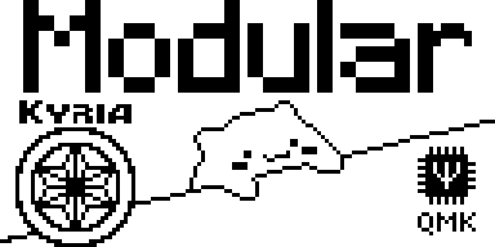

# Modular Bongo Cat

  

This Modular Bongo Cat uses diffs instead of complete frames, thus saving space.  
*Why Modular?* It is super easy to remove the QMK logo, or Kyria logo to save additional space in your firmware.  
Instead you could also create and add your own logo. 
For that I have added a python script (`png_to_short_arr.py`) that you can use, to generate the arrays and diffs from your own images.  
I also added the bongocat frames, that I have redrawn by hand in the folder [bongocat_frames](bongocat_frames)

For an example of how to use it in your keymap look in [/kyria/keymaps/dakes/](/kyria/keymaps/dakes/)

## How to draw your own images
Any Image manipulation program will do, though I recommend Krita.  
It doesn't matter if you choose to use black or white for "Pixel on" , since you can invert it later in the python skript using the flag `invert_colors`.  
I prefer to use black for on, since it is easier visible.  
The important part is to use transparency for the background, since it will be interpreted as "ignore pixel" and not included in the final array, thus saving tremendous space.  
The disadvantage is, that everything that was drawn before, at that position, will "shine through", since the pixel will stay on. This could be wanted or not.  
Usually you should only use the off color (White in my case) when you know, you want to turn off a pixel, that was on before.  
For Example the Kyria logo only uses white to overwrite the black line of the base frame. If I would paint all the interior of the logo white firmware space would be wasted, 
since all the pixels below it are always off anyway.  
Finally it is important to save your image as png with 8-bit color depth, because jpg does not support transparency.  

### Convert to array
In `png_to_short_arr.py` you will have to include your new images in the `frame_filenames` list. 
Add your images to the `bongocat_frames` folder, execute the python script, while being in the keymap folder,  
or edit `path_to_images` to point to the folder with your images.  
The output will be an Array formatted so, that you can copy paste it into your keymap.  

If you want to add logos, etc. use the output from the section `Pixel values without diff`.  
If you want to replace Bongocat, by for example the blush frames, use the output from `Pixel diffs with idle_0.png as the base frame` 
and put them in the appropriate diff arrays. 

### Add to keymap
Add the arrays and function calls where the comments say `// Add your own logos here, or remove to save firmware size`  
The function `render_short_array_pos` will render the array. 
The 1. parameter is a pointer to your `uint16_t PROGMEM` array
The 2. and 3. parameters are x and y coordinates, from where it should start to draw the image. 
Note, that with images, coordinates start from the top left. 
The 4th parameter is the width of your image. 

## Size comparison
|                                    | James Incandenza's (j-inc) original  | Pierre Chevalier's bongo_light  | Dakes' Modular Bongo Cat | Dakes' Modular Bongo Cat (without Kyria and QMK logo) |
| ---------------------------------- | ------------------------------------ | ------------------------------- | ------------------------ | ----------------------------------------------------- |
| Bytes saved compared to j-inc's    | 0                                    | 3830                            | 3216                     | 4564                                                  |
| additional bytes needed            | 7210                                 | 3380                            | 3994                     | 2646                                                  |
| in bytes free (for my measurement) | 1670                                 | 5500                            | 4886                     | 6234                                                  |


Notes:
- The numbers for bongo_light don't include the changes to drivers/oled.  
- You could remove `#include <stdio.h>` from Pierre Chevalier's bongo_light and replace `sprintf` by my method of rendering the WPM String 
  to save additional ~1200 bytes. 

# Conway's Game of Life
This is the famous Conway's Game of Life designed to run on split keyboards with OLEDs of the size 128x64.  
With minor modifications, it should work on other keyboards and screensizes as well.  
Look here for a demonstration: [Conway's Game of Life for QMK running on a 128x64 OLED](https://www.youtube.com/watch?v=1h1coIJXcSQ)  

## How to add it to your keymap
copy `conway.c` and `conway.h` to your own userspace (qmk_firmware/users/*your_name*/).  
Add 
```C
# ifdef CONWAY_ENABLE
#define SPLIT_TRANSACTION_IDS_USER CONWAY_SYNC
# endif
``` 
this from `config.h` to your userspace `config.h`.  
Copy all Code from `rules.mk` regarding conway to your own userspace `rules.mk` (Marked with comments)  
The functions `process_record_user`, `keyboard_post_init_user`, `housekeeping_task_user` in `conway.c` use the weak attribute, so if you use those in your own keymap, you have to copy their code to your own keymaps functions. (Only one function call each. )

## Customization
There are numerous customizations possible, in `rules.mk` and `conway.h`
### rules.mk
Since they are defined with `?=` you can just copy these to your keymap `rules.mk` to define them there, or change them in the userspace `rules.mk` directly.  
`MASTER_HALF ?= yes`: The master and slave half require different code, to conserve firmware size. Select here for which half to compile.  
`CONWAY_ENABLE ?= yes`: Switch conway on or off. (For both master and slave)  
`CONWAY_MASTER ?= no`: Put conway onto the master, or slave.  

`KYRIA_MATRIX_FIX ?= yes`: Fix kyria / split keyboard matrix. Spawn points of right half to the right. For other split kbs, other than the SplitKb Kyria™ you may want to adjust the corresponding code. Or just disable it.  
`EGDE_KILL ?= yes`: Kill live cells, that are on the edge.  
`HELD_SPAWN ?= yes`: If keys are held for a longer time (adjustable in conway.h). More cells will be toggled at random, in a radius of 1, 2 or 3.  

### conway.h

This is the position, where new points, depending on keypresses will be spawned in. 
```C
#define MATRIX_POS_X 24
#define MATRIX_POS_Y 22
```

This is the time, that has to pass for held down keys, to spawn in more points in a radius of 1, 2 and 3
```C
#define SPAWN_INTERVAL_1 250
#define SPAWN_INTERVAL_2 2000
#define SPAWN_INTERVAL_3 4000
```

`#define GOSPER_GLIDER_GUN 3, 1`: Whether to add a Gosper Glider gun (generator) and the x, y position where to add it. (Comment out to disable).  
`#define BEACON 55, 10`: Whether to add a Beacon at the given coordinates.  
Please modify the code directly, if you want to add more than one of those. Just add another call to `gosper_glider_gun(field, x, y);` with your desired coordinates.  

### conway.c
If you want to add your own structures, that will be shown after boot up, use the `SET_CELL(field[x], y);` macro in the `conway()` function in `if (structures_set == false)`.  
Or even better, create your own function, like `beacon(field, x, y)` or `gosper_glider_gun(field, x, y)`. That way you can add multiple copies, in different locations. 

## Building
Unfortunately you have to change `MASTER_HALF ?= yes` every time, you compile it for the other half. (Otherwise the firmware was just too big for me)


# Hotswap Trackball
With the bottom housing of a sacrificial switch, a few headers, standoffs and epoxy putty it is possible to make the pimoroni trackball hotswappable, like so:  

<p align="center">
    
    &nbsp; &nbsp; &nbsp; 
    
    &nbsp; &nbsp; &nbsp;
    
    &nbsp; &nbsp; &nbsp;
    
</p>
<p align="center">
    
    &nbsp; &nbsp; &nbsp; &nbsp;
    
    &nbsp; &nbsp; &nbsp; &nbsp;
    
</p>
